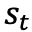

## Теоретическая часть ДЗ 3 по Оирс
##### Выполнила Бояркина Е., ИУ8-81

1.	Опишите общий принцип работы сверточных нейронных сетей.

Рассмотрим на примере 2х2 матрицы входных данных (например, черно-белой картинки). Сначала к входным данным применяется 
операция свертки. В общем виде у нас есть ядро свертки (матрица маленького размера), она поэлементно перемножается на 
элементы матрицы, затем складывается результат поэлементного умножения и записывается в ячейку новой матрицы. На рисунке 
можно увидеть, как это делается:

При этом не всегда берутся все возможные варианты подматриц из исходной матрицы (как на картинке выше). Иногда 
пространство вокруг может заполняться базовыми значениями (как правило, нулевыми), чтобы граничные ячейки тоже оказывали 
влияние на выходной результат. В таком случае матрица может остаться той же размерности, как и на входе (в первом случае 
она уменьшалась). Такой подход называется Padding.

Также иногда мы, наоборот, хотим сильнее уменьшить размерность исходных данных. В таком случае можно добавить шаг 
скольжения ядру: обрабатывать не любую подматрицу, а, например, брать подматрицы с шагом два от предыдущей (изображено 
на рисунке ниже). Такой подход называется Striding.

На выходе свертки мы получаем карту признаков. К ней мы применяем пулинг. На этом слое из признаков, которые операция 
свертки выделила из входных данных, выбираются самые важные. Как правило, здесь мы используем max pooling (выбор 
максимального из n значений, последующее его использование), хотя в некоторых моделях пулинг может быть на основе взятия 
минимума, усреднения результатов и т.п.

 
Комбинация свертки и пулинга называется сверточным слоем. Как правило, в нейросети несколько таких слоев, к которым 
также может применяться функция активации. После определенного слоя мы получаем на выходе вектор (или матрицу, которую 
неким образом преобразуем в вектор), и дальше обрабатываем его уже при помощи полносвязной нейронной сети: многослойного 
перцептрона, линейной регрессии и т.п. В итоге получим примерно такую сеть:

2.	Чем хороши сверточные нейронные сети?

 - Использование ядер свёртки дает, в сравнении с полносвязанной нейросетью, меньшее количество настраиваемых весовых 
коэффициентов, что приводит к уменьшению времени и вычислительных ресурсов на обучение сети;
 - Использование ядер свёртки также помогает избежать покомпонентного запоминания, подталкивая сеть к обобщению 
демонстрируемой информации. Локальное восприятие позволяет сохранить общий вид исходных данных от слоя к слою при 
значительном сокращении вычислений. Благодаря сканированию целой области, а не отдельных точек, подход позволяет учесть 
общие свойства информации, что увеличивает качество обработки;
 - Также сверточные слои позволяют изменять размер исходного изображения до определенного уровня, что позволяет 
обрабатывать входные данные разных размеров одной сетью (просто приводя входной размер к требуемому по определенным 
правилам);
 - Можно обучать при помощи классического метода обратного распространения ошибки, при этом можно использовать и другие 
методы обучения сети (в том числе и методы «без учителя»).

3.	Опишите общий принцип работы рекуррентных нейронных сетей.

Рекуррентная нейронная сеть выполняет одну и ту же операцию для всех элементов последовательности, причем результат 
работы на каждом шаге зависит от предыдущих вычислений. Другая интерпретация рекуррентных сетей: это сети, у которых 
есть «память», которая учитывает предыдущие вычисления. Таким образом, рекуррентная нейронная сеть может быть 
представлена как один нейрон с обратной связью, но иногда для удобства понимания работы сети изображают ее развертку. 
Пример развертки приведен на рисунке:

Здесь  – вход на временном шаге t. 

 – скрытое состояние на шаге t, так называемая «память» сети; зависит от 
предыдущих состояний и входа сети, как правило, таким образом: . 

 – выход на шаге t.

На рисунке изображены выходы на каждом шаге сети. В реальности, выход может быть всего один, или могут быть слои только 
со входами, а затем слои только с выходами и т.п. Эти параметры сети зависят от конкретной задачи.

4.  Чем хороши рекуррентные нейронные сети?

 - Сеть может обрабатывать входные данные разной длины;
 - Выход зависит от всех предыдущих входов, а не только от входа на текущем шаге;
 - Размер модели не увеличивается из-за увеличения размера входных данных.

5.	Приведите примеры задач, в которых можно было бы применить сверточные нейронные сети / рекуррентные нейронные сети.

Сверточные нейронные сети: распознавание объектов на изображениях (буквы и цифры, животные, люди, машины, распознавание 
раковых опухолей и прочих аномалий на снимках), классификация документов по темам, генерация картинок по описанию. 

Рекуррентные нейронные сети: генерация текстов, машинный перевод, распознавание речи, генерация описания изображений.

