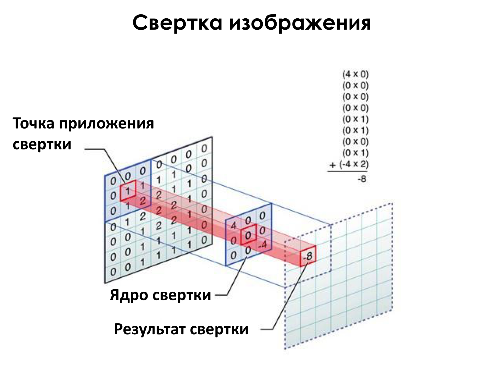
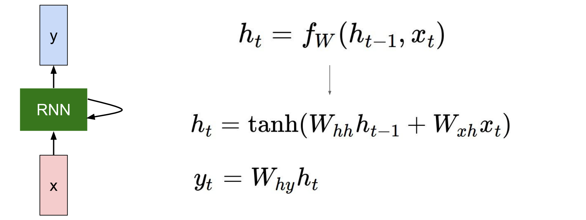

# Часть теоретическая

1. **Опишите общий принцип работы сверточных нейронных сетей.**

Рассмотрим один слой сверточной НС. На нем находятся несколько фильтров (также называемых ядрами), 
каждый из которых меньше размера изображения. Фильтр представляет собой 
матрицу, именно ее коэффициенты и обучаются. Фильтром порходят по изображению, 
смещая его по горизонтали на l пикселей и после обработки всей строки по вертикали на k, 
затем повторяют процедуру. 
Применение фильтра представляет собой поэлементное умножение весов фильтра на матрицу пикселей, 
перекрываемых фильтром при наложении в текущий момент времени. 
Складывают полученные значения и получают значение пикселя для выходной матрицы.
Положение каждого полученного таким образом пикселя соответствует положению фильтра на момент подсчета.
К полученному изображению применяют max pooling или другие нелинейности. 
max pooling представляет собой способ уменьшения объема данных. Изображение 
разбивается на сегменты, каждый из которых заменяется на максимальное 
значение пикселя внутри сегмента. Аналогично можно применять среднее и другие функции

Таким образом составляется несколько сверточных слоев, после чего выход последнего 
слоя раскладывается в массив пикселей и подается на вход полносвязной НС

2. **Чем хороши сверточные нейронные сети?** 

Основное преимущество сверточных НС в том, что в отличие от полносвязных 
они могут вытаскивать информацию о пространственных связях на изображении. 
Если до сверточных НС пиксели картинки построчно сливали в один длинный массив, 
и вертикальные связи пикселей терялись, то в CNN мы проходимся фильтрами по картинке, 
сохраняя пространственные связи. Веса фильтров настраиваются в процессе обучения. 
Фильтр является своего рода лампочкой, загорающейся (имеющей на выходе большие по модулю значения) при появлении на картинке паттерна, 
описываемого данным фильтром. Однако мы не увидим глаза или нос если посмотрим на фильтры CNN, 
распознающей лица

3. **Опишите общий принцип работы рекуррентных нейронных сетей.**

Тексты кодируются с помощью предобученных моделей, преврящаясь в эмбединги (вектора). 
Внутри ячейки RNN находится матрица состояния h, хранящая информацию о встреченных ранее словах. 
В каждый момент времени на вход ячейке подается h с предыдущего шага и эмбединг текущего слова. 
По формулам ниже вычисляется новое скрытое состояние и выход ячейки. При генерации 
текста на вход в каждый следующий момент времени подается выход в предыдущий момент времени

4. **Чем хороши рекуррентные нейронные сети?**

Рекуррентные НС хороши тем, что они способны помнить контекст достаточно длинных входов. 
Это позволяет работать с текстом, а не со словами по отдельности.

5. **Приведите примеры задач, в которых можно было бы применить сверточные нейронные сети / рекуррентные нейронные сети**

Сверточные НС применяются для работы с изображениями: классификации, распознавание объектов
Рекуррентные НС применяются для работы с текстом: классификация, перевод, кластеризация, генерация текста

Критерии приемки: ответ должен быть понятным, полным, красиво оформленным.
